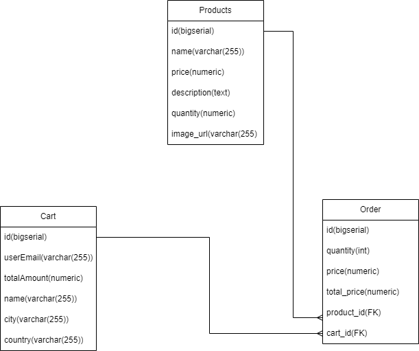

# Front End

### Main Page

For **View Products,** You can click on any item to view its detail and add it to cart.

### Product Detail page

For **Add Item to Carts** You can see the product details and add item to cart

When you click **Add to Cart** , product is added to cart and message is show

### Cart Page

For **Confirm Purchase** In the cart page you can view your cart and confirm order

You can click on order now to confirm order

### Order Confirm Page

# Backend

## Database

### **Tables**

#### Product

###### **Usage** :

* Used to maintain a catalog of available products.
* Each row represents a unique product with associated details.

#### Cart

###### Usage

* Stores essential information about each order made by users.
* Links to `orders` table to establish relationships between orders and products ordered.

#### Order

This table serves as an intermediary table to manage the many-to-many relationship between orders and products.

###### **Usage** :

* Captures which products were included in each order and in what quantities.
* Enables efficient querying of products associated with a specific order.
