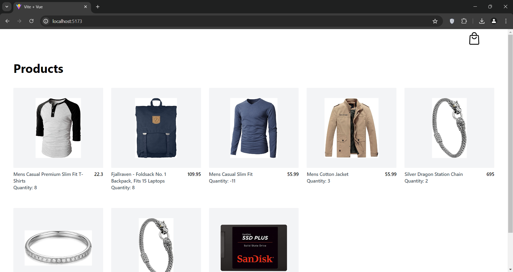
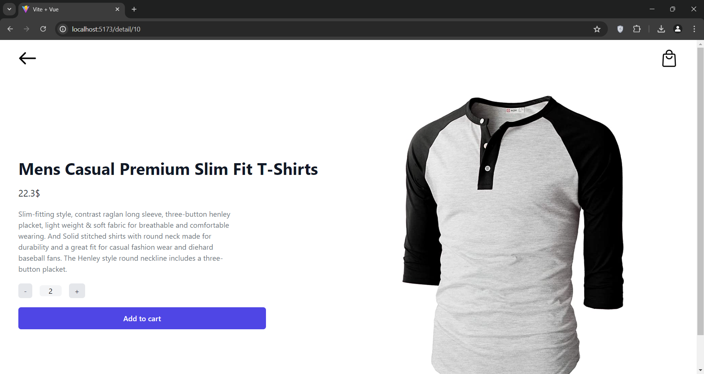
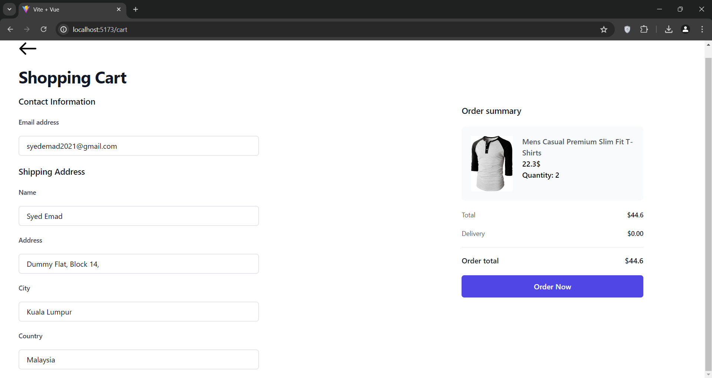
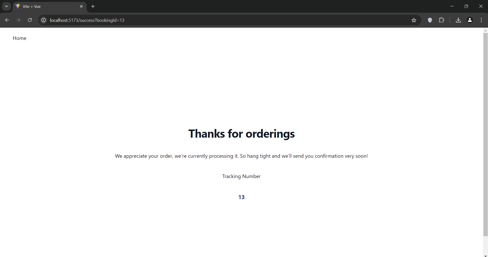

# Overview

### Main Page

You can click on any item to view its detail and add it to cart.



### Product Detail page

You can see the product details and add item to cart



When you click **Add to Cart** , product is added to cart and message is show


### Cart Page

In the cart page you can view your cart and confirm order



You can click on order now to confirm order

### Order Confirm Page



# How to get started

## Step1:

clone the repository using the following command

```
git clone https://github.com/syed-emad/MindValley-Assingment.git
```

### Running The Database

Open command prompt

To run Postgress database run this command

```
docker-compose up
```

This will start a configured docker container for postgres database

**Note: You will need docker desktop to run the docker image, incase you dont have it follow the steps in the link below**

To check if database is running you can open docker desktop or type in the follow command

```
docker ps
```

### Running the Backend

To run the backend please make sure you have Elixir and Erland installed in you device

Follow the steps here in order to setup Elixir: https://elixir-lang.org/install.html

Once you have Elixir setup.

Check if Elixir is installed properly by running

```
elixir -v
```

#### Run the following commands to start Frontend

Install dependencies

```
mix deps.get
```

Create tables in the database

```
mix ecto.migrate
```

Seed the database

```
mix run priv/repo/seeds.exs
```

Start the server

```
mix phx.server
```

server wil start on port 4000

### Running the Frontend

Go to frontend folder/shoppin-cart-app

open command promp

#### Run the following commands to start Backend

Install dependencies:

```
npm i
```

Start the project

```
npm run dev
```

Project will output the acceible url for example

```
http://localhost:5173/
```
